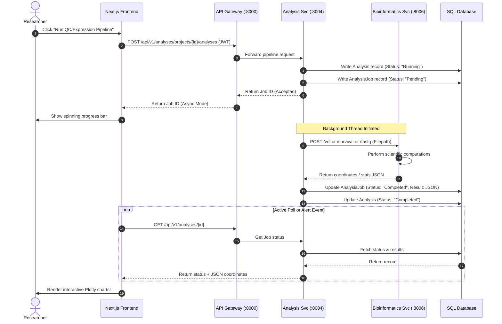
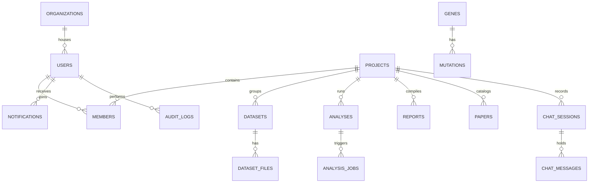

# NeuroGen AI: Software Requirements Specification (SRS) & System Design Blueprint

This document serves as the official Software Requirements Specification (SRS), Database Schema Design, API Documentation, and UI/UX Wireframe Blueprint for **NeuroGen AI**—the AI-powered Brain Cancer Bioinformatics Platform.

---

## Part 1: Software Requirements Specification (SRS)

### 1. Product Overview
NeuroGen AI is an advanced, microservice-based bioinformatics platform designed to catalog, analyze, and visualize multi-omic clinical datasets (genomic, transcriptomic, imaging, and clinical outcomes) for brain cancer research. The platform integrates background bioinformatics pipelines with an AI research assistant to facilitate hypothesis generation, biomarker discovery, and collaborative clinical trials.

### 2. Strategic Goals
- **Unified Workbench**: Eliminate data silos by housing genetic sequences (FASTA/FASTQ), variant call formats (VCF), patient survival matrices, and MRI scans (DICOM) in a single collaborative workspace.
- **Explainable Clinical AI**: Equip oncological researchers with an AI assistant capable of parsing uploaded datasets, explaining target pathways (e.g. EGFRvIII/PI3K/mTOR), and proposing combination-therapy hypotheses.
- **Supervised Sandboxes**: Enable academic professors to supervise students' analysis pipelines and audit logs to verify research integrity prior to publication.

### 3. User Roles & Permission Matrix
The system enforces Role-Based Access Control (RBAC) across five specialized roles:

| Role | Description | Access Permissions |
| :--- | :--- | :--- |
| **Researcher** | Clinical bioinformatician analyzing data. | Create projects, upload datasets, execute analysis pipelines, generate reports, write chat sessions. |
| **Professor** | Academic lead supervising lab projects. | All Researcher rights + review audit logs, annotate student analyses, delete projects, manage team members. |
| **Student** | Junior researcher learning oncology pipelines. | Join assigned projects, run preset pipelines, generate AI hypotheses, read reports. Cannot invite members. |
| **Lab Tech** | Laboratory staff managing raw bio-samples. | Upload datasets (FASTQ/BAM), manage sample tracking sheets, audit server storage. Cannot run clinical survival curves. |
| **Hospital Admin**| Clinical partner managing de-identified cohorts. | Upload de-identified clinical datasets, manage HIPAA access controls, export cohort overall survival metrics. |

---

### 4. Functional Requirements (FR)
- **FR-1: Secure Auth**: Users must register and log in via JWT or Google OAuth. Verification mail and password reset must be supported.
- **FR-2: Drag-and-Drop Uploader**: Support uploads up to 50MB locally (expandable to 5GB in S3 mode) for FASTA, FASTQ, CSV, Excel, VCF, BAM, DICOM, and PDF.
- **FR-3: Quality Control Pipeline**: Run automated Phred quality scoring over FASTQ sequences and plot score distributions per read cycle.
- **FR-4: Transcriptomic Analysis**: Compute volcano plots and gene expression heatmaps from uploaded CSV expression matrices.
- **FR-5: Mutation Mapping**: Generate lollipop diagrams showing specific mutation frequencies (e.g., L858R) along amino acid coordinates of target proteins (EGFR/TP53).
- **FR-6: Kaplan-Meier Survival Curve**: Construct survival probability curves and calculate the log-rank test statistic for designated cohorts.
- **FR-7: Pathway Network Generation**: Build node-link cytoscape structures representing signaling pathway cascades colored by active expression levels.
- **FR-8: AI Contextual Chat**: Chatbot must respond to brain cancer molecular biology questions and read current workspace files to summarize details.
- **FR-9: Report Compilation**: Compile markdown research papers incorporating charts and export to PDF, DOCX, or XLSX.
- **FR-10: Audit Trails**: Record every user write operation (creation, editing, pipelines run, reports exported) into an immutable audit table.

### 5. Non-Functional Requirements (NFR)
- **NFR-1 (Security)**: All database connections must use SSL. Sensitive clinical columns must be encrypted at rest (AES-256). Compliance with HIPAA requirements for de-identified datasets.
- **NFR-2 (Latency)**: API Gateway routing latency must be under 50ms. Page load time must be under 1.5 seconds.
- **NFR-3 (Scalability)**: Bioinformatics tasks must run asynchronously to prevent gateway thread locks. Celery worker pools must auto-scale based on queue sizes.
- **NFR-4 (Availability)**: 99.9% uptime. Automated database backups performed daily.

---

### 6. System Workflows

#### 6.1. Asynchronous Analysis Pipeline Execution Flow
The following sequence details how a background bioinformatics job is triggered and updated:



---

## Part 2: Database Design Schema

NeuroGen AI uses a relational database schema. Foreign key constraints ensure data consistency, and indexes are placed on columns frequently used in query filters.

### Entity Relationship Diagram (ERD)



### Table Definitions

#### 1. `organizations`
Stores tenant organizations (universities, hospitals, labs).
- **Columns**:
  - `id`: `INTEGER` (PK, Auto-increment)
  - `name`: `VARCHAR(100)` (Unique, Indexed)
  - `created_at`: `DATETIME` (Default: utcnow)
- **Constraints**: Name cannot be null.

#### 2. `users`
Profiles registered researchers, students, and supervisors.
- **Columns**:
  - `id`: `INTEGER` (PK, Auto-increment)
  - `email`: `VARCHAR(100)` (Unique, Indexed)
  - `hashed_password`: `VARCHAR(100)` (Not Null)
  - `full_name`: `VARCHAR(100)` (Not Null)
  - `role`: `VARCHAR(50)` (Default: 'Researcher') - Check constraint: `role IN ('Researcher', 'Professor', 'Student', 'Lab', 'Hospital')`
  - `organization_id`: `INTEGER` (FK -> `organizations.id`, Nullable)
  - `created_at`: `DATETIME`

#### 3. `projects`
Collaborative workspaces grouping datasets and analyses.
- **Columns**:
  - `id`: `INTEGER` (PK, Auto-increment)
  - `name`: `VARCHAR(100)` (Indexed)
  - `description`: `TEXT` (Nullable)
  - `organization_id`: `INTEGER` (FK -> `organizations.id`, Nullable)
  - `created_at`: `DATETIME`

#### 4. `members`
Maps users to projects with custom workspace roles.
- **Columns**:
  - `id`: `INTEGER` (PK, Auto-increment)
  - `project_id`: `INTEGER` (FK -> `projects.id` ON DELETE CASCADE, Indexed)
  - `user_id`: `INTEGER` (FK -> `users.id` ON DELETE CASCADE, Indexed)
  - `role`: `VARCHAR(50)` (Default: 'Collaborator') - Check constraint: `role IN ('Owner', 'Supervise', 'Collaborator', 'Reader')`
  - `joined_at`: `DATETIME`
- **Indexes**: Unique index on `(project_id, user_id)` to prevent duplicate memberships.

#### 5. `datasets`
Logical groups of sequence/clinical data files.
- **Columns**:
  - `id`: `INTEGER` (PK, Auto-increment)
  - `project_id`: `INTEGER` (FK -> `projects.id` ON DELETE CASCADE, Indexed)
  - `name`: `VARCHAR(100)`
  - `type`: `VARCHAR(50)` - Check constraint: `type IN ('Genomic', 'Transcriptomic', 'Imaging', 'Clinical')`
  - `created_by`: `INTEGER` (FK -> `users.id`)
  - `created_at`: `DATETIME`

#### 6. `dataset_files`
Metadata for physical files saved on local storage/S3.
- **Columns**:
  - `id`: `INTEGER` (PK, Auto-increment)
  - `dataset_id`: `INTEGER` (FK -> `datasets.id` ON DELETE CASCADE, Indexed)
  - `filename`: `VARCHAR(255)` (Not Null)
  - `file_path`: `VARCHAR(510)` (Not Null)
  - `file_size`: `INTEGER` (Not Null)
  - `file_type`: `VARCHAR(50)` - Check constraint: `file_type IN ('FASTA', 'FASTQ', 'CSV', 'Excel', 'VCF', 'BAM', 'DICOM', 'PDF')`
  - `status`: `VARCHAR(50)` (Default: 'uploaded') - Check: `status IN ('uploaded', 'parsing', 'parsed', 'failed')`
  - `qc_metrics`: `JSON` (Nullable) - Stores computed nucleotide stats/columns list.
  - `created_at`: `DATETIME`

#### 7. `analyses`
High-level records representing pipeline executions.
- **Columns**:
  - `id`: `INTEGER` (PK, Auto-increment)
  - `project_id`: `INTEGER` (FK -> `projects.id` ON DELETE CASCADE, Indexed)
  - `name`: `VARCHAR(100)`
  - `type`: `VARCHAR(50)` - Check: `type IN ('QC', 'Expression', 'Mutation', 'Survival', 'Pathway')`
  - `status`: `VARCHAR(50)` (Default: 'Pending') - Check: `status IN ('Pending', 'Running', 'Completed', 'Failed')`
  - `created_by`: `INTEGER` (FK -> `users.id`)
  - `created_at`: `DATETIME`

#### 8. `analysis_jobs`
Specific background tasks mapping to microservice workers.
- **Columns**:
  - `id`: `INTEGER` (PK, Auto-increment)
  - `analysis_id`: `INTEGER` (FK -> `analyses.id` ON DELETE CASCADE, Indexed)
  - `celery_task_id`: `VARCHAR(100)` (Nullable)
  - `status`: `VARCHAR(50)` (Default: 'Pending')
  - `error`: `TEXT` (Nullable)
  - `result`: `JSON` (Nullable) - Stores coordinate metrics (Volcano, Lollipop, KM step points).
  - `started_at`: `DATETIME` (Nullable)
  - `completed_at`: `DATETIME` (Nullable)

#### 9. `reports`
Compiled clinical summary papers.
- **Columns**:
  - `id`: `INTEGER` (PK, Auto-increment)
  - `project_id`: `INTEGER` (FK -> `projects.id` ON DELETE CASCADE)
  - `name`: `VARCHAR(100)`
  - `content`: `TEXT` (Not Null)
  - `format`: `VARCHAR(20)` (Default: 'PDF') - Check: `format IN ('PDF', 'Word', 'Excel')`
  - `created_by`: `INTEGER` (FK -> `users.id`)
  - `created_at`: `DATETIME`

#### 10. `genes`
System reference library mapping common brain cancer markers.
- **Columns**:
  - `id`: `INTEGER` (PK, Auto-increment)
  - `symbol`: `VARCHAR(50)` (Unique, Indexed)
  - `name`: `VARCHAR(150)` (Not Null)
  - `description`: `TEXT` (Nullable)
  - `genomic_coordinates`: `VARCHAR(100)` (Nullable)
  - `created_at`: `DATETIME`

#### 11. `mutations`
Genetic mutation reference frequencies and clinical impact annotations.
- **Columns**:
  - `id`: `INTEGER` (PK, Auto-increment)
  - `gene_id`: `INTEGER` (FK -> `genes.id` ON DELETE CASCADE, Indexed)
  - `mutation_type`: `VARCHAR(100)` (Missense, Truncation, Methylation)
  - `change`: `VARCHAR(100)` (e.g. L858R, EGFRvIII)
  - `clinical_significance`: `TEXT` (Nullable)
  - `created_at`: `DATETIME`

#### 12. `papers`
Research references/PDF files imported for contextual AI training.
- **Columns**:
  - `id`: `INTEGER` (PK, Auto-increment)
  - `project_id`: `INTEGER` (FK -> `projects.id` ON DELETE CASCADE)
  - `title`: `VARCHAR(255)` (Not Null)
  - `authors`: `VARCHAR(255)`
  - `journal`: `VARCHAR(100)`
  - `abstract`: `TEXT` (Nullable)
  - `url`: `VARCHAR(255)`
  - `published_at`: `DATETIME`
  - `created_at`: `DATETIME`

#### 13. `chat_sessions`
AI discussion sessions in a project workspace.
- **Columns**:
  - `id`: `INTEGER` (PK, Auto-increment)
  - `project_id`: `INTEGER` (FK -> `projects.id` ON DELETE CASCADE, Indexed)
  - `user_id`: `INTEGER` (FK -> `users.id`)
  - `title`: `VARCHAR(150)` (Default: 'New Chat Session')
  - `created_at`: `DATETIME`

#### 14. `chat_messages`
Stores individual chat query logs.
- **Columns**:
  - `id`: `INTEGER` (PK, Auto-increment)
  - `session_id`: `INTEGER` (FK -> `chat_sessions.id` ON DELETE CASCADE, Indexed)
  - `role`: `VARCHAR(20)` - Check: `role IN ('user', 'assistant')`
  - `content`: `TEXT` (Not Null)
  - `created_at`: `DATETIME`

#### 15. `notifications`
System alerts for sequencing completions and access invites.
- **Columns**:
  - `id`: `INTEGER` (PK, Auto-increment)
  - `user_id`: `INTEGER` (FK -> `users.id` ON DELETE CASCADE, Indexed)
  - `title`: `VARCHAR(150)` (Not Null)
  - `message`: `TEXT` (Not Null)
  - `is_read`: `BOOLEAN` (Default: False)
  - `created_at`: `DATETIME`

#### 16. `audit_logs`
System audit logging table.
- **Columns**:
  - `id`: `INTEGER` (PK, Auto-increment)
  - `user_id`: `INTEGER` (FK -> `users.id` ON DELETE SET NULL, Nullable)
  - `action`: `VARCHAR(255)` (Not Null)
  - `target_type`: `VARCHAR(100)` (Project, Dataset, Report)
  - `target_id`: `INTEGER` (Nullable)
  - `timestamp`: `DATETIME`

---

## Part 3: API Documentation Specification

This section documents the REST endpoints exposed by the API Gateway (`http://localhost:8000/api/v1/...`).

### 1. Authentication Service
#### `POST /api/v1/auth/login`
- **Description**: Authenticate user credentials and return a session token.
- **Headers**: `Content-Type: application/json`
- **Request Body**:
  ```json
  {
    "email": "researcher@lab.org",
    "password": "SecurePassword123"
  }
  ```
- **Response** (200 OK):
  ```json
  {
    "access_token": "eyJhbGciOiJIUzI1NiIsInR5cCI6IkpXVCJ9...",
    "token_type": "bearer",
    "user": {
      "id": 12,
      "email": "researcher@lab.org",
      "full_name": "Dr. Nagarjuna N",
      "role": "Researcher",
      "organization_id": 1
    }
  }
  ```
- **Error Codes**:
  - `401 Unauthorized`: Incorrect email or password.
  - `422 Unprocessable Entity`: Validation failed (e.g. invalid email format).

---

### 2. Project Service
#### `POST /api/v1/projects/projects`
- **Description**: Initialize a new collaborative project workspace.
- **Authentication**: JWT Required (`Authorization: Bearer <Token>`)
- **Request Body**:
  ```json
  {
    "name": "GBM EGFRvIII Study",
    "description": "Downstream signaling mapping"
  }
  ```
- **Response** (200 OK):
  ```json
  {
    "id": 4,
    "name": "GBM EGFRvIII Study",
    "description": "Downstream signaling mapping",
    "created_at": "2026-07-12T06:00:00Z",
    "role": "Owner"
  }
  ```
- **Error Codes**:
  - `401 Unauthorized`: Missing or expired token.

#### `GET /api/v1/projects/projects`
- **Description**: Retrieve all project workspaces where the caller is a registered team member.
- **Authentication**: JWT Required
- **Response** (200 OK):
  ```json
  [
    {
      "id": 4,
      "name": "GBM EGFRvIII Study",
      "description": "Downstream signaling mapping",
      "created_at": "2026-07-12T06:00:00Z",
      "role": "Owner"
    }
  ]
  ```

#### `GET /api/v1/projects/projects/{id}`
- **Description**: Fetch workspace parameters for a single project.
- **Authentication**: JWT Required
- **Response** (200 OK):
  ```json
  {
    "id": 4,
    "name": "GBM EGFRvIII Study",
    "description": "Downstream signaling mapping",
    "created_at": "2026-07-12T06:00:00Z",
    "role": "Owner"
  }
  ```
- **Error Codes**:
  - `403 Forbidden`: User is not a member of this project.
  - `404 Not Found`: Project does not exist.

---

### 3. Dataset Service
#### `POST /api/v1/datasets/datasets/{dataset_id}/upload`
- **Description**: Upload a sequencing read file (FASTQ), variant map (VCF), or matrix (CSV).
- **Authentication**: JWT Required
- **Request Format**: `multipart/form-data`
- **Form Data**:
  - `file`: `<Binary File Data>`
- **Response** (200 OK):
  ```json
  {
    "id": 22,
    "dataset_id": 2,
    "filename": "reads_run4.fastq",
    "file_size": 2451020,
    "file_type": "FASTQ",
    "status": "uploaded",
    "qc_metrics": {
      "format": "FASTQ",
      "lines": 0,
      "notes": "Pending deep bioinformatics parsing..."
    },
    "created_at": "2026-07-12T06:02:10Z"
  }
  ```
- **Error Codes**:
  - `413 Payload Too Large`: Upload exceeds size limits.

---

### 4. Analysis Service
#### `POST /api/v1/analyses/projects/{project_id}/analyses`
- **Description**: Trigger an asynchronous pipeline analysis (QC, Expression, Mutation, Survival, Pathway).
- **Authentication**: JWT Required
- **Request Body**:
  ```json
  {
    "name": "EGFR Lollipop Pipeline",
    "type": "Mutation",
    "dataset_file_id": 22
  }
  ```
- **Response** (200 OK):
  ```json
  {
    "analysis_id": 9,
    "job_id": 14,
    "name": "EGFR Lollipop Pipeline",
    "type": "Mutation",
    "status": "Running"
  }
  ```
- **Error Codes**:
  - `404 Not Found`: Dataset file not found.

#### `GET /api/v1/analyses/analyses/{analysis_id}`
- **Description**: Fetch job state and computed coordinate matrices.
- **Authentication**: JWT Required
- **Response** (200 OK):
  ```json
  {
    "id": 9,
    "project_id": 4,
    "name": "EGFR Lollipop Pipeline",
    "type": "Mutation",
    "status": "Completed",
    "created_at": "2026-07-12T06:05:00Z",
    "job": {
      "id": 14,
      "status": "Completed",
      "error": null,
      "started_at": "2026-07-12T06:05:01Z",
      "completed_at": "2026-07-12T06:05:08Z",
      "result": {
        "gene": "EGFR",
        "protein_length": 1210,
        "mutations": [
          {"position": 858, "count": 18, "type": "Missense", "change": "L858R", "domain": "Kinase"}
        ],
        "domains": [
          {"name": "Tyrosine Kinase", "start": 685, "end": 957}
        ]
      }
    }
  }
  ```

---

### 5. Report Service
#### `GET /api/v1/reports/projects/{project_id}/reports`
- **Description**: List compiled research summaries.
- **Authentication**: JWT Required
- **Response** (200 OK):
  ```json
  [
    {
      "id": 1,
      "name": "Glioblastoma EGFRvIII Report v1",
      "format": "PDF",
      "created_at": "2026-07-12T06:08:00Z",
      "created_by": 12
    }
  ]
  ```

---

### 6. AI Service
#### `POST /api/v1/ai/chats/{chat_id}/messages`
- **Description**: Send a research query or file summarization request to the clinical AI agent.
- **Authentication**: JWT Required
- **Request Body**:
  ```json
  {
    "content": "Compare TP53 and IDH1 prognostic survival outcomes"
  }
  ```
- **Response** (200 OK):
  ```json
  {
    "id": 156,
    "role": "assistant",
    "content": "### Molecular Profile: IDH1 vs. TP53...\n* **IDH1**: Mutant indicates favorable prognosis...\n* **TP53**: Loss of checkpoint control...",
    "created_at": "2026-07-12T06:10:02Z"
  }
  ```

---

### 7. Bioinformatics Reference Service
#### `GET /api/v1/bioinformatics/genes/{symbol}`
- **Description**: Fetch database reference annotations for a genetic oncology marker.
- **Authentication**: JWT Required
- **Response** (200 OK):
  ```json
  {
    "symbol": "EGFR",
    "name": "Epidermal Growth Factor Receptor",
    "description": "Proto-oncogene heavily amplified in glioblastomas, leading to constitutive kinase cascades.",
    "coordinates": "chr7:55,019,017-55,211,628"
  }
  ```
- **Error Codes**:
  - `404 Not Found`: Gene symbol not registered.

---

## Part 4: UI/UX Wireframe Blueprint

This section provides visual representations of the platform's key layout nodes.

### 1. Landing Page
```
+-----------------------------------------------------------------------------+
|  [Brain Icon] NeuroGen AI                                    [Sign In] [Register] |
+-----------------------------------------------------------------------------+
|                                                                             |
|   DECODING BRAIN CANCER GENOMES VIA                           / \           |
|   BIO-COMPUTATION & AI                                       /   \          |
|                                                             |  O  |         |
|   Empowering clinics and labs to parse FASTA,               \     /         |
|   VCF variants, and Kaplan-Meier curves.                     \   /          |
|                                                               \ /           |
|      [Enter Platform]  [Register Workspace]              Pulsing Brain SVG  |
|                                                                             |
+-----------------------------------------------------------------------------+
|   [ Researchers ]  [ Professors ]  [ Students ]  [ Labs ]  [ Hospitals ]    |
|                                                                             |
|   * Cohort de-identification (HIPAA compliant)                             |
|   * Statistical survival step curves plotting                               |
|   * S3 Storage direct uploads                                               |
+-----------------------------------------------------------------------------+
```

### 2. Login Page
```
+-----------------------------------------------------------------------------+
|                                 [Brain Icon]                                |
|                              Welcome to NeuroGen                            |
|                                                                             |
|                       +-----------------------------+                       |
|                       | Email Address               |                       |
|                       | [ name@lab.org            ] |                       |
|                       |                             |                       |
|                       | Password         [Forgot?]  |                       |
|                       | [ **********              ] |                       |
|                       |                             |                       |
|                       |         [ Sign In ]         |                       |
|                       |                             |                       |
|                       |  ----------- or ----------- |                       |
|                       |                             |                       |
|                       |   [ Sign In with Google ]   |                       |
|                       +-----------------------------+                       |
|                                                                             |
|                        Need an account? [Create one]                        |
+-----------------------------------------------------------------------------+
```

### 3. Main Dashboard
```
+-----------------------------------------------------------------------------+
|  [Logo] NeuroGen AI                                [Bell] [User Profile] [Exit] |
+-----------------------------------------------------------------------------+
|  Welcome back, Dr. Nagarjuna N (Researcher)                                 |
|  +-----------------------------------------------------------------------+  |
|  | [ Projects: 4 ]  [ Datasets: 8 ]  [ Analyses: 12 ]  [ Reports: 4 ]    |  |
|  +-----------------------------------------------------------------------+  |
|                                                                             |
|  Recent Projects                             System Alerts                  |
|  +-------------------------+  +-----------+  +---------------------------+  |
|  | Glioblastoma EGFR study |  | Project B |  | (Bell) reads_run4 parsed  |  |
|  | Role: Owner             |  | Role: Col |  | 5 minutes ago             |  |
|  | [Open Workspace]        |  | [Open]    |  |                           |  |
|  +-------------------------+  +-----------+  | (Bell) Invite approved    |  |
|  +-------------------------+                 | 1 hour ago                |  |
|  | Project C               |                 +---------------------------+  |
|  | Role: Supervisor        |                 +---------------------------+  |
|  | [Open Workspace]        |                 | Tip: Run VCF pipelines to |  |
|  +-------------------------+                 | map mutation frequencies. |  |
|                                              +---------------------------+  |
+-----------------------------------------------------------------------------+
```

### 4. Project Workspace Command Center Layout
The workspace layout is governed by a left navigation bar and a dynamic display stage.

#### 4.1. Datasets Tab
```
+-----------------------------------------------------------------------------+
|  <- Project Name (ID: #4)                           [Local Sandbox Badge]  |
+-----------------------------------------------------------------------------+
|  Pipelines      | Datasets Workspace                                        |
|  * Datasets     | +-------------------------------------------------------+ |
|  * QC           | | Type: [Genomic]  [Select File Area...]   [ Upload ]   | |
|  * Expression   | +-------------------------------------------------------+ |
|  * Mutation     |                                                           |
|  * Survival     | Uploaded Files                                            |
|  * Pathway      | +-------------------------------------------------------+ |
|  * AI Chat      | | Filename        | Format  | Size   | Status | Action  | |
|  * Reports      | |-----------------|---------|--------|--------|---------| |
|  * Team         | | reads.fastq     | FASTQ   | 2.4 MB | parsed | [QC]    | |
|                 | | expression.csv  | CSV     | 0.8 MB | parsed | [Run]   | |
|                 | +-------------------------------------------------------+ |
+-----------------------------------------------------------------------------+
```

#### 4.2. Quality Control (QC) Tab
```
+-----------------------------------------------------------------------------+
|  <- Project Name (ID: #4)                           [Local Sandbox Badge]  |
+-----------------------------------------------------------------------------+
|  Pipelines      | Quality Control Dashboard                                 |
|  * Datasets     | [Selected: reads_qc_job_04]  [Run QC Demo Pipeline]       |
|  * QC           |                                                           |
|  * Expression   | +------------------+ +----------------------------------+ |
|  * Mutation     | | Reads: 5,000     | | Phred Quality Score Line Chart   | |
|  * Survival     | | Bases: 750,000   | | 40 |      _..---.._              | |
|  * Pathway      | | Avg: 150 bp      | | 30 |    /           \            | |
|  * AI Chat      | +------------------+ | 20 |  /               \          | |
|  * Reports      |                      |  0 +-------------------          | |
|  * Team         |                      |    1                  50 cycles  | |
|                 |                      +----------------------------------+ |
+-----------------------------------------------------------------------------+
```

#### 4.3. Gene Expression Tab
```
+-----------------------------------------------------------------------------+
|  <- Project Name (ID: #4)                           [Local Sandbox Badge]  |
+-----------------------------------------------------------------------------+
|  Pipelines      | Transcriptomic Gene Expression                           |
|  * Datasets     | [Selected: matrix_expr_01]  [Run Expression Matrix]       |
|  * QC           |                                                           |
|  * Expression   | +------------------------+ +----------------------------+ |
|  * Mutation     | | Expression Heatmap     | | Volcano Plot (Scatter)     | |
|  * Survival     | | Genes vs Patient Samples| | -log10P                    | |
|  * Pathway      | |   S1 S2 S3             | |  8 |     *   * (sig red)   | |
|  * AI Chat      | | G1 [R] [B] [R]         | |  4 |   *   *                | |
|  * Reports      | | G2 [B] [R] [B] (colors)| |  0 +--------------------   | |
|  * Team         | +------------------------+ |     -4   0   4  log2FC     | |
|                 |                          +----------------------------+ |
+-----------------------------------------------------------------------------+
```

#### 4.4. Mutation Explorer Tab
```
+-----------------------------------------------------------------------------+
|  <- Project Name (ID: #4)                           [Local Sandbox Badge]  |
+-----------------------------------------------------------------------------+
|  Pipelines      | Mutation Frequencies on Protein Coordinates               |
|  * Datasets     | [Selected: mutations_vcf_01]  [Run Mutation Lollipop]     |
|  * QC           |                                                           |
|  * Expression   | +-------------------------------------------------------+ |
|  * Mutation     | | Lollipop Chart (EGFR)                                 | |
|  * Survival     | | Freq                                                  | |
|  * Pathway      | |  20 |     O  (L858R)                                  | |
|  * AI Chat      | |  10 |     |      O (EGFRvIII)                         | |
|  * Reports      | |   0 +-----|------|---------------------------------   | |
|  * Team         | |    [L-domain]   [Transmembrane]   [Kinase Domain]     | |
|                 | |          Residue Coordinates (1 - 1210 aa)            | |
|                 | +-------------------------------------------------------+ |
+-----------------------------------------------------------------------------+
```

#### 4.5. Survival Analysis Tab
```
+-----------------------------------------------------------------------------+
|  <- Project Name (ID: #4)                           [Local Sandbox Badge]  |
+-----------------------------------------------------------------------------+
|  Pipelines      | Overall Survival Analysis (Kaplan-Meier Curve)            |
|  * Datasets     | [Selected: survival_run_01]  [Run KM Survival]            |
|  * QC           |                                                           |
|  * Expression   | +-------------------------------------------------------+ |
|  * Mutation     | | Survival Prob                                         | |
|  * Survival     | | 1.0 +-----\_____ (IDH1 mutant, blue)                  | |
|  * Pathway      | | 0.5 |      \_____                                     | |
|  * AI Chat      | | 0.0 +------------\_____ (IDH1 wildtype, purple)       | |
|  * Reports      | |     0                   1200 days                     | |
|  * Team         | | Log-Rank Test p-value = 0.000412 (Significant)        | |
|                 | +-------------------------------------------------------+ |
+-----------------------------------------------------------------------------+
```

#### 4.6. Pathway Crosstalk Tab
```
+-----------------------------------------------------------------------------+
|  <- Project Name (ID: #4)                           [Local Sandbox Badge]  |
+-----------------------------------------------------------------------------+
|  Pipelines      | Pathway Signaling Interaction Network                     |
|  * Datasets     | [Selected: pathway_run_01]  [Run Pathway Network]         |
|  * QC           |                                                           |
|  * Expression   | +-------------------------------------------------------+ |
|  * Mutation     | | Cytoscape Interactive Network                         | |
|  * Survival     | |                                                       | |
|  * Pathway      | |    [ EGFR (red) ]  =====>  [ KRAS ]  =====>  [ RAF ]  | |
|  * AI Chat      | |          ||                                           | |
|  * Reports      | |          v                                            | |
|  * Team         | |    [ PI3K (red) ]  <--|inhibits|-- [ PTEN (blue) ]     | |
|                 | |                                                       | |
|                 | | (Click node to view coordinates and description here)  | |
|                 | +-------------------------------------------------------+ |
+-----------------------------------------------------------------------------+
```

#### 4.7. AI Chat Tab
```
+-----------------------------------------------------------------------------+
|  <- Project Name (ID: #4)                           [Local Sandbox Badge]  |
+-----------------------------------------------------------------------------+
|  Pipelines      | AI Research Assistant                                     |
|  * Datasets     |                                                           |
|  * QC           | +------------------------+ +----------------------------+ |
|  * Expression   | | Discussion List        | | Chat Stream Window         | |
|  * Mutation     | |------------------------| | User: Explain EGFRvIII     | |
|  * Survival     | | Discussion #1          | | AI: EGFRvIII represents a  | |
|  * Pathway      | | Discussion #2          | | deletion of exons 2-7...   | |
|  * AI Chat      | | [New Chat]             | |                            | |
|  * Reports      | |                        | | [Type message...]    [Send]| |
|  * Team         | +------------------------+ +----------------------------+ |
+-----------------------------------------------------------------------------+
```

#### 4.8. Reports and Exports Tab
```
+-----------------------------------------------------------------------------+
|  <- Project Name (ID: #4)                           [Local Sandbox Badge]  |
+-----------------------------------------------------------------------------+
|  Pipelines      | Compiled Clinical Reports                                 |
|  * Datasets     | [ Compile New Summary Report ]                            |
|  * QC           |                                                           |
|  * Expression   | +-------------------------------------------------------+ |
|  * Mutation     | | Report Title           | Date       | Format | Action | |
|  * Survival     | |------------------------|------------|--------|--------| |
|  * Pathway      | | GBM Study Summary v1   | 2026-07-12 | PDF    | [Down] | |
|  * AI Chat      | | Pathways Analysis v2   | 2026-07-12 | Word   | [Down] | |
|  * Reports      | +-------------------------------------------------------+ |
|  * Team         |                                                           |
+-----------------------------------------------------------------------------+
```

#### 4.9. Team Collaboration Tab
```
+-----------------------------------------------------------------------------+
|  <- Project Name (ID: #4)                           [Local Sandbox Badge]  |
+-----------------------------------------------------------------------------+
|  Pipelines      | Project Collaborators List                                |
|  * Datasets     | +-------------------------------------------------------+ |
|  * QC           | | Email: [ collaborator@lab.org ]  Scope: [Collab] [Inv] | |
|  * Expression   | +-------------------------------------------------------+ |
|  * Mutation     |                                                           |
|  * Survival     | Registered Members                                       |
|  * Pathway      | +-------------------------------------------------------+ |
|  * AI Chat      | | User Name       | Email              | Workspace Role | |
|  * Reports      | |-----------------|--------------------|----------------| |
|  * Team         | | Dr. Nagarjuna N | researcher@lab.org | Owner          | |
|                 | | Prof. Smith     | smith@univ.edu     | Supervise      | |
|                 | +-------------------------------------------------------+ |
+-----------------------------------------------------------------------------+
```

#### 4.10. Settings Panel
```
+-----------------------------------------------------------------------------+
|  [Logo] NeuroGen AI                                [Bell] [User Profile] [Exit] |
+-----------------------------------------------------------------------------+
|  Workspace Settings                                                         |
|                                                                             |
|  +-----------------------------------------------------------------------+  |
|  | Organization Profile                                                  |  |
|  | Name: [ Harvard Medical Center                 ]                      |  |
|  +-----------------------------------------------------------------------+  |
|  +-----------------------------------------------------------------------+  |
|  | Storage Configuration                                                 |  |
|  | Active Provider: ( ) Local Sandbox File Storage                       |  |
|  |                  (*) AWS S3 Bucket Storage                            |  |
|  | Bucket name: [ neurogen-clinical-datasets-bucket      ]               |  |
|  +-----------------------------------------------------------------------+  |
|  +-----------------------------------------------------------------------+  |
|  | AI API Integrations                                                   |  |
|  | Provider: [ OpenAI API ]                                              |  |
|  | API Key:  [ ***************************************** ] [Update]      |  |
|  +-----------------------------------------------------------------------+  |
|                                                        [ Save Settings ]    |
+-----------------------------------------------------------------------------+
```

#### 4.11. Admin Control Panel
```
+-----------------------------------------------------------------------------+
|  [Logo] NeuroGen AI                                [Bell] [User Profile] [Exit] |
+-----------------------------------------------------------------------------+
|  System Administrator Dashboard                                             |
|                                                                             |
|  Active Tenants & Stats                         System Audit Trails         |
|  +-------------------------------------------+  +-------------------------+ |
|  | Organizations: 14                         |  | 06:10:02 Admin logged   | |
|  | Users: 152                                |  | 06:05:00 VCF parsed     | |
|  | Active Analyses: 8                        |  | 05:58:12 User registered | |
|  +-------------------------------------------+  +-------------------------+ |
|                                                                             |
|  Tenant Management                              System Settings           |
|  +-------------------------------------------+  +-------------------------+ |
|  | Harvard Research [Edit] [Disable]         |  | Storage quota: [100 GB] | |
|  | Stanford Oncology [Edit] [Disable]        |  | Max upload:    [500 MB] | |
|  +-------------------------------------------+  +-------------------------+ |
+-----------------------------------------------------------------------------+
```
